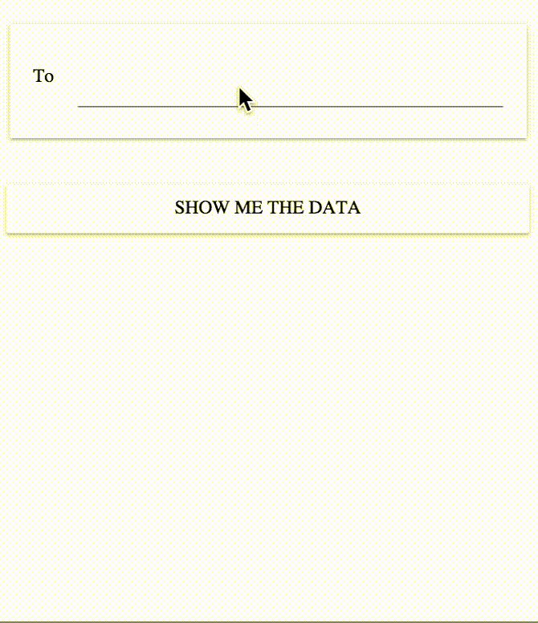

# paper-people-list

This is what it does. It acts as an autocomplete list from which you can select people, and store the selected people in the form of chips.



## Installation

```shell
bower install paper-people-list
```

## How to use

```html
<paper-people-list
  data="{{data}}"
  on-search-changed="handleChange"></paper-people-list>
```
where `data` is the list of data that needs to be displayed in the dropdown when the user types in the search box.

## Attributes

| Attribute name | Type | Description |
|----------------|------|-------------|
| data | Array of Objects | The data that will be displayed in the dropdown. It consists of three things. `avatar` : The url of the image icon. `name` : The name that needs to be displayed along with the `avatar`. And `identifier` : which will used to identify the data. This `identifier` can be **email id** or **username** or anythign like that. | 

An example value of `data` attribute can be

```json
[
  {
    "avatar": "abc.png",
    "name": "Some Random Name"
	"identifier": "someemail@random.com"
  },
  ...
]
```

This will need to be updated everytime a `search-changed` event is observed.

## Events

| Event name | Description |
|------------|-------------|
| search-changed | This is an event that gets emitted everytime the user types something in the search field. |

## Values

At any point in time, if you would like to see the list of people selected by the user, you can use the following code.
```javascript
document.querySelector("paper-people-list").people
```

The `people` variable stores the **Array Object** of the selected people.